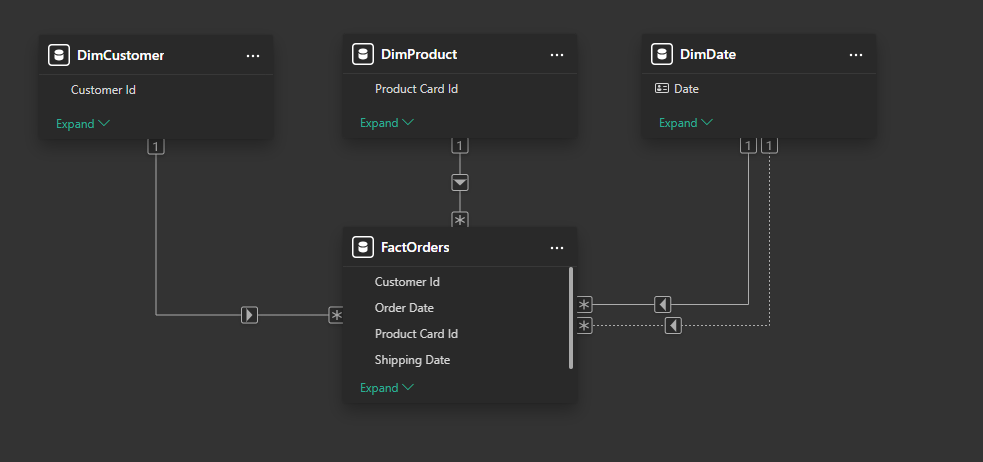
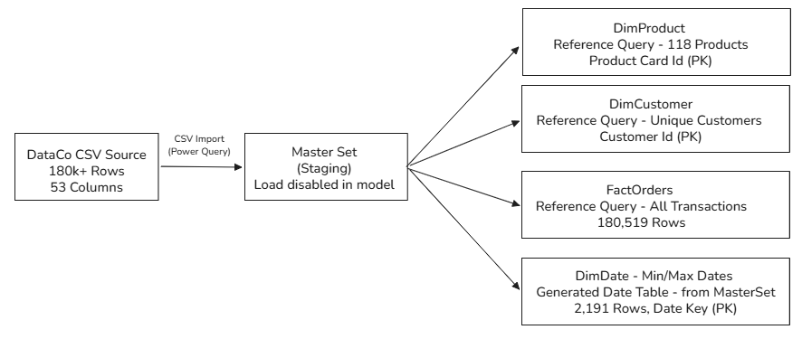

# ABC Product Segmentation & Inventory Management

## Business Problem

A Power BI solution built on the DataCo Smart Supply Chain dataset. It addresses questions warehouse and distribution operations ask every day: which SKUs drive revenue, what to cycle count first, where to hold safety stock, and when late shipments point to higher stockout risk. Those answers live in one standard report everyone can use, not scattered spreadsheets or undocumented know-how held only by select individuals. ABC inventory tiers are built from revenue contribution. The Power BI report links this product classification system to cycle counting schedules and replenishment planning, and flags stockout risk earlier.

---

## Background

ABC inventory classification is one of the most fundamental tools in supply chain operations. In practice it's often done manually, inconsistently, and stored entirely in someone's head. This project systematizes that process by connecting product revenue segmentation to cycle counting programs, PAR levels, safety stock calculations, and replenishment triggers.

---

## What This System Does

- Classifies every product SKU into A, B, or C tiers based on revenue contribution using the Pareto principle
- Generates PAR levels and replenishment thresholds with automated reorder flags
- Calculates safety stock using demand volatility and supplier lead time variance
- Produces a cycle counting program by ABC tier
- Flags potential stockout risk early
- Provides an executive summary with key findings and actionable recommendations

---

## Dataset

- **Name:** DataCo Smart Supply Chain for Big Data Analysis  
- **Where to get it:** [Kaggle dataset page](https://www.kaggle.com/datasets/shashwatwork/dataco-smart-supply-chain-for-big-data-analysis) (free Kaggle account required to download)  
- **Grain:** 180,519 rows, 53 columns  
- **File to use after download:** Kaggle usually ships a `.zip`. Unzip it, then point Power BI at **`DataCoSupplyChainDataset.csv`** (the single large CSV that matches the grain above). If the archive lists a slightly different file name, use that same main extract. Skip small files such as previews, demos, or sample downloads that come in the same zip. They are not the full dataset.  
- **Why it is not in this repo:** The raw CSV is not committed here (size, licensing, and Kaggle access). The published `.pbix` milestones and these docs assume that file. To **refresh** on your PC, connect the model to your local copy of the CSV (see **Download the report and open it in Power BI** → step 4).

---

## Download the report and open it in Power BI

**Prerequisite:** Download [Power BI Desktop](https://powerbi.microsoft.com/desktop/) (Windows).

**Note:** The `.pbix` file is the full report and data model in one package.

**Milestone files:** Each phase ships a `.pbix` as a **GitHub Release asset** (same pattern as Phase 1). Release binaries are **not** stored on the `main` branch; they are built and versioned on phase branches (e.g. `etl-layer`, `model-layer`) and attached to the release for download.

**1. Get the Phase 1 snapshot (ETL milestone)**

- Open: [Phase 1 - ETL Data Preparation Layer](https://github.com/howardchungnyc/abc-segmentation-inventory-management/releases/tag/phase-1-etl-data-preparation-layer).
- Under **Assets**, download **`ABC_Product_Segmentation_Inventory_Management_phase_1_etl_layer.pbix`**.

**2. Get the Phase 2 snapshot (model layer)**

- Open: [Phase 2 - Model Layer](https://github.com/howardchungnyc/abc-segmentation-inventory-management/releases/tag/phase-2-model-layer).
- Under **Assets**, download **`ABC_Product_Segmentation_Inventory_Management_phase_2_model_layer.pbix`**.

**3. Open and explore**

- Double-click the `.pbix` file, or in Power BI Desktop use **File → Open report** and select the file.
- Use the page tabs at the bottom to move between report pages. Use **slicers** and **visual interactions** (click bars, legends) to filter and explore. **Save As** if you want your own copy with a new name.
- **You may not need the CSV just to look around.** The file often already contains a copy of the data inside it. In that case you can browse the report as soon as it opens.

**4. When you need the Kaggle CSV (refresh or fix the data source)**

- **Skip this step if the report loads and you only want to view it.** Come back here if **Refresh** fails, Power BI warns you about a missing file, or you want to pull in a **new** download of the dataset.
- The CSV is **not** stored in this GitHub repo, and the path inside the `.pbix` points to wherever the file lived on the machine that built it. **Your** computer needs its **own** path to the file.
- **Get the right file from Kaggle:** Download from [DataCo Smart Supply Chain on Kaggle](https://www.kaggle.com/datasets/shashwatwork/dataco-smart-supply-chain-for-big-data-analysis) (you need a free Kaggle account). If you get a **`.zip`**, unzip it. Point Power BI at **`DataCoSupplyChainDataset.csv`**, the one large CSV with **180,519 rows** and **53 columns** (see **Dataset** above). You do **not** need to change paths on `DimProduct`, `DimCustomer`, or `FactOrders`; they read from **`MasterSet`**, which is the only query that should load the flat file.
- **Easiest path (recommended if you are new to Power BI):** In Power BI Desktop (report view, not Power Query yet), go to **File → Options and settings → Data source settings**. Select the **Text/CSV** (or similar) entry that points to the old or missing path → **Change Source…** → **Browse** and select your local **`DataCoSupplyChainDataset.csv`** → confirm → **Close**. Then **Home → Refresh**.
- **If you prefer Power Query:** **Home → Transform data**. In the **Queries** list on the left, click **`MasterSet`**. In **Applied steps** on the right, click the first step (**Source**). Use the **gear** icon next to Source if you see one to pick the file again, or edit the file path in the **formula bar** so it points to your **`DataCoSupplyChainDataset.csv`**. Then **Close & Apply**.
- **Home → Refresh** reloads from that file. Later phase releases will add additional `.pbix` milestones under their own release tags.

---

## Data Model Architecture

Star schema with one main transaction (fact) table (`FactOrders`, 180,519 rows) and three lookup (dimension) tables (`DimProduct`, `DimCustomer`, `DimDate`). **Phase 2** finalized model relationships (many-to-one, single direction), **Order Date** active and **Shipping Date** inactive to `DimDate`, **Sort by column** on calendar labels, hidden keys where appropriate, **display folders** on `FactOrders`, Power Query **query groups**, `DimDate` **hierarchies**, and a **model validation** measure suite documented in **`decision-log.md`**.

### Shared `DimDate` calendar: Order Date vs. Shipping Date

**Order Date** and **Shipping Date** both use the same calendar table (`DimDate`). **Order Date** is the primary filter for most time intelligence analysis. **Shipping Date** is the secondary timeline, so you can run the same **order-line** analysis (revenue, volume, margin, fulfillment, late-delivery risk, and other fact-table measures) on either the **Order Date** calendar or the **Shipping Date** calendar (the latter via `USERELATIONSHIP` in DAX when needed).

### Model Relationships (Star Schema)

### Query Architecture (Power Query)

---

## Report Pages

| Page | Title | Description |
|---|---|---|
| 1 | ABC Classification Dashboard | Product revenue contribution, Pareto curve, segment breakdown, cycle count program |
| 2 | Operational Implications | Reorder frequency, PAR levels, safety stock, lead time variance, stockout risk, carrying cost |
| 3 | Executive Summary | 3 findings, 2 recommendations, 1 KPI |

---

## Key Architectural Decisions

See **`decision-log.md`** for the full log through **Phase 1 (ETL)** and **Phase 2 (model layer)**—**Document Version 2.0**, Entries #1–#13. Summary:

**Phase 1 (ETL)**

1. **Single source staging table (MasterSet)** — single CSV load; all queries reference one table; staging not loaded to the model  
2. **Auto-updating date table (Dynamic DimDate)** — range from source min/max with 1-year padding  
3. **Dynamic Late Delivery Risk** — replaced the pre-labeled source risk flag (ML target) with Lead Time Variance > 0  
4. **Two late-risk columns** — integer (0/1) for DAX; logical (True/False) for visuals  
5. **Consistent column ordering** — PK → FKs → date keys → attributes → measures → calculated fields  

**Phase 2 (model layer)**

6. **Sort by column on `DimDate` labels** — chronological order in visuals (paired with Phase 1 sort-key columns)  
7. **Hidden keys / internal columns** — surrogate and foreign keys hidden from report view where appropriate  
8. **Default summarization** — Don’t summarize on non-additive fields; explicit DAX in Phase 3  
9. **Display folders on `FactOrders`** — navigable field list for measure authoring  
10. **Power Query groups** — `_Staging`, `Facts`, `Dimensions`  
11. **Date hierarchies on `DimDate`** — explicit drill paths (Year–Month–Day; Year–Quarter–Month)  
12. **Model validation suite** — DAX tests for row count, date range, and dimension integrity (`_Validation` folder)  
13. **Model Validation page kept in `.pbix`** — reference for what was tested and outcomes  

---

## Project Phases

| Phase | Status | Development & Milestone (dev branch → PBIX GitHub Release) |
|---|---|---|
| Phase 1 - ETL Data Preparation Layer | ✅ Complete | Developed on [`etl-layer`](https://github.com/howardchungnyc/abc-segmentation-inventory-management/tree/etl-layer). PBIX: [Phase 1 Release](https://github.com/howardchungnyc/abc-segmentation-inventory-management/releases/tag/phase-1-etl-data-preparation-layer). |
| Phase 2 - Model Layer | ✅ Complete | Developed on [`model-layer`](https://github.com/howardchungnyc/abc-segmentation-inventory-management/tree/model-layer). PBIX: [Phase 2 - Model Layer](https://github.com/howardchungnyc/abc-segmentation-inventory-management/releases/tag/phase-2-model-layer). |
| Phase 3 - DAX Layer | 🔄 In Progress | Develop on `dax-layer` (branch is for development only). When complete, publish the PBIX snapshot as a GitHub Release. |
| Phase 4 - Page 1 Visuals | ⬜ Pending | Develop on `page-1-visuals` (branch is for development only). When complete, publish the PBIX snapshot as a GitHub Release. |
| Phase 5 - Page 2 Visuals | ⬜ Pending | Develop on `page-2-visuals` (branch is for development only). When complete, publish the PBIX snapshot as a GitHub Release. |
| Phase 6 - Page 3 Visuals | ⬜ Pending | Develop on `page-3-visuals` (branch is for development only). When complete, publish the PBIX snapshot as a GitHub Release. |
| Phase 7 - v1.0 Complete | ⬜ Pending | Finalize on `release/v1.0`. Publish the PBIX snapshot as a GitHub Release; update `main` with final docs for the portfolio. |

---

## Documentation

| File | Description |
|---|---|
| `README.md` | Project summary, report structure, download links, and business purpose |
| `decision-log.md` | Architectural and analytical decisions with reasoning — Phases 1–2 (ETL + model layer), Document Version 2.0 |
| `column-definition.md` | Complete data dictionary — source to model column mapping |

---

## Tools & Technologies

- **Power BI Desktop** - builds dashboards and interactive reports
- **Power Query (M)** - ETL and data transformation
- **DAX** - creates measures, calculated columns, and KPIs
- **Star Schema** - Kimball dimensional modeling organizes tables for faster, clearer reporting

---

## Author

**Howard Chung** 
Operations Manager | Operations Analyst | Business Operations 
Long Island City, NY

LinkedIn: [linkedin.com/in/howardchungnyc](https://www.linkedin.com/in/howardchungnyc/)
